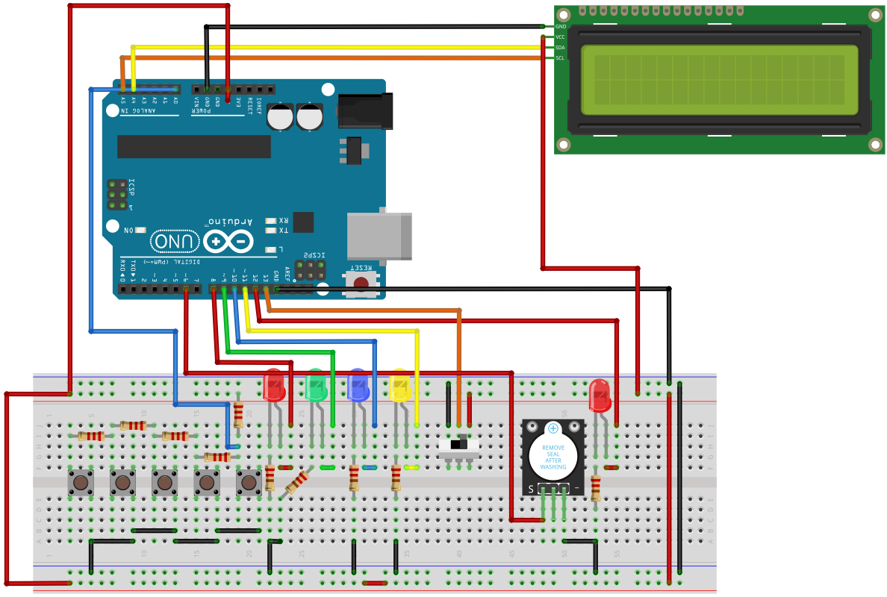

# Description

The game "Repeat the colors" is a memory game. It's based on a electronic game (Simon) of short-term memory skill invented by
Ralph H. Baer and Howard J. Morrison, working for toy design firm Marvin Glass and Associates.

The device has four colored buttons, each producing a particular color when it's pressed or activated by the device. 
The microcontroller will generate a string of random numbers whose length will increase after each stage in which there 
was a match between the  LEDs on and the buttons being pressed. The string must be transposed in color. 

A round in the game consists of the device lighting up one or more buttons in a random order, after which the player 
must reproduce that order by pressing the buttons. As the game progresses, the number of buttons to be pressed increases. 
When the player makes a mistake, a maximum score will be set, and at the push of a button, it will be possible to restart 
the game. The current score will be displayed on an LCD display, and will be updated after each round. Using one button change 
the difficulty of the game. The game has 3 difficultyies ( EASY, NORMAL and HARD). The degree of difficulty will consist in 
the speed with which the LEDs will light up, respectively the waiting time between pressing two buttons by the player.

# Improvements

- Reset button;
- Adding a LED that tells the player that the controlls are unaveilable for use at the time because the device is busy right now ( e.g. when showing the pattern to player );
- Adding a buzzer that emits a specific sound for each of the main 4 colored LEDs when turned on. 
Default sounds are the following : C# (277Hz), D# (311Hz), F#(370Hz), G#(415);
- Adding a second mode that can be accesed by using a switch. This mode has only song, one for every main button (4 songs), that are saved in microcontroller.

# Components

- 1 breadboard;
- arduino uno
- LCD with I2C adaptor;
- 1 buzzer;
- 5 leds;
- 1 switch;
- 4 buttons;
- wires male-male;
- wires male-female;
- 220 kOhm ( 5 resistors );
- 1 kOhm ( 4 resistors );

# Schematic

